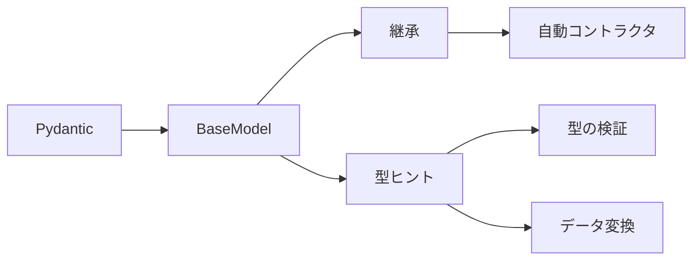

# リクエスト処理

---

## パスパラメータによるリクエスト処理

### パスパラメータ

* リクエスト処理でURLの一部として指定される値
* URLの一部を変数として使用する
* リソースを特定する役割

### 特徴

* URLに埋め込まれる
* 型ヒントで自動バリデーションする
* 一意に対象が決まるもの向き

### 例

```python
@app.get("/users\{user_id}")
async def get_user(user_id: int):
  # データベースからuser_idに該当するユーザ情報を取得する処理
```

上記の場合「/users/123」でアクセスすると

1. **user_id** に ***123*** が入る
2. IDが123のユーザ情報を取得する処理が実行される
   1. **{user_id}** が **123*** を受け取る
   2. **123** のID情報でユーザ情報にアクセスする

このとき、**パスパラメータと関数の引数を同盟にする** ことでURLから取得した値を直接関数の引数に渡すことができる。

---

## クエリによるリクエスト処理

* リクエスト処理でURLの一部として **キーと値** のペアで情報を送信する方法
* URLの **?** の後に配置される
* 検索・絞り込み・オプション指定の役割

### 特徴

* `?key=value`形式
* デフォルト値で任意となる
* フィルタ・並び替え・ページング向き

### 例

```python
@app.get("/books/")
async def get_books_by_catogory(category: str | None = None):
  # データベースからcategoryに該当する書籍情報を取得する処理
```

上記の場合、「/books/?category=technical」というリクエストで関数を呼び出すと **technical** カテゴリの書籍のみを取得する。

`category: str | None = None` でデフォルト値を **None** に設定しているため、クエリパラメータを指定しない場合は「/books/」のリクエストとなる。

---

## レスポンス処理

* APIを通じてデータがクライアントに返される方法がレスポンスである

### レスポンスデータ

* APIのエンドポイントからの出力
* 通常JSON形式で送信されることが多い
* 使用者が理解しやすい構造を定義する必要がある

### レスポンスデータの構造

* 以下の理由より、1度のリクエストで必要な条件を簡潔に提供できる構造が望ましい
  * 効率性の向上
  * ユーザビリティの向上
  * リソースの節約

### Pydantic

* Pythonでデータの変換とバリデーションを簡易化するためのライブラリ
* バリデーション＋変換＋ドキュメント化を担う
* リクエスト/レスポンスのデータを安全かつ一貫性ある形で扱う

### Pydanticの役割

* バリデーション
  * 入力ミス・型不整合を即検知
* データ変換
  * JSON → Pythonオブジェクトを安全に変換
* 契約の明文化
  * API仕様をコードとして一元管理


